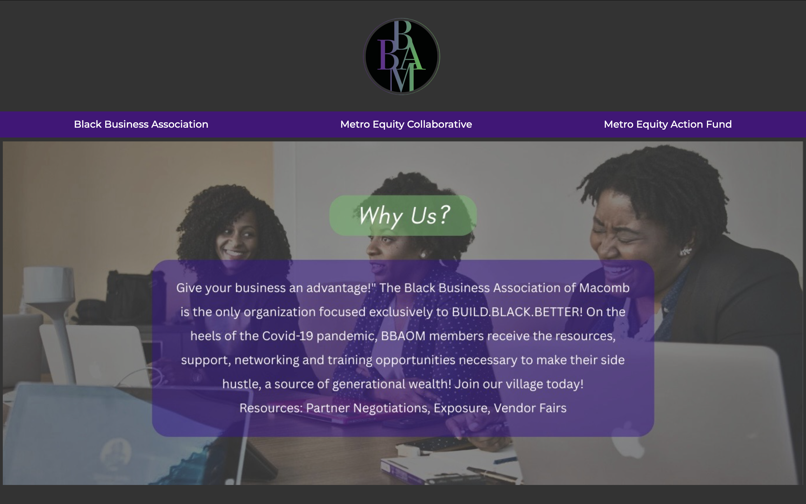
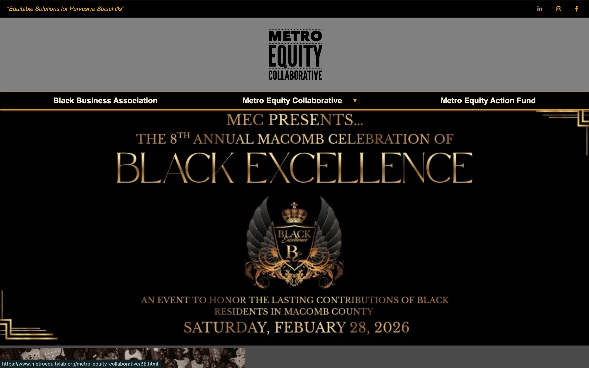
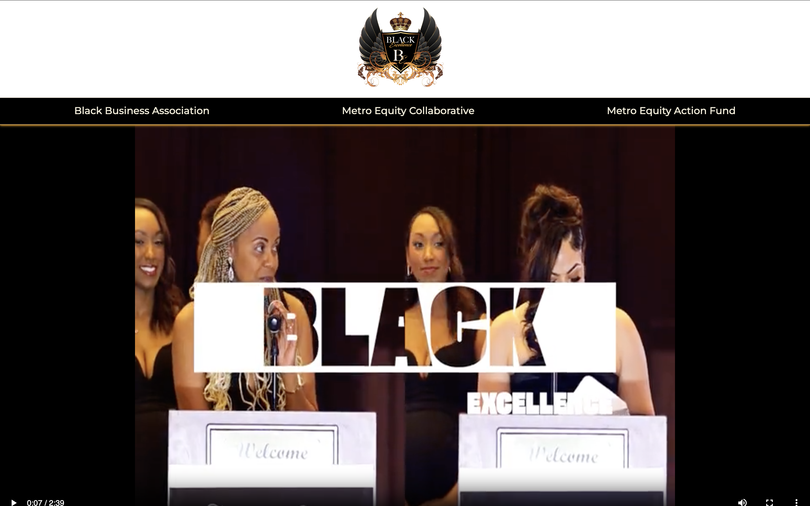

# Metro Equity Lab Website Project

## Overview 
This project is a multi-page website built for a non-profit company that represents three organizartions under one shared platform.
Each organization has its own page and content, while still existing within one overall website structure.

Two of the organizations currently have active pages. The third organization is planned for future development and is currently listed as "COMING SOON!".

## Purpose 
The purpose of this project is to provide a professional web presence for multiple related organizations within a single website.
The site is designed to organize content clearly while giving each organization its own distinct identity and pages.

## Technologies Used
- HTML
- CSS
- JavaScript

## Project Structure
The repository includes:
- 4 HTML files
- 3 CSS files
- 3 JavaScript files
- image folders for website assests

## Screenshots 
### Black Business Association of Macomb

### Metro Equity Collaborative 

### Black Excellence (subpage)

## Live Site
[View the live website](link)

## Features 
- Multi-page website structure
- Separate pages for different organizations
- Shared design system across the site
- Responsive layout improvements
- Ongoing updates and maintenance

## What I Worked On
This project demonstrates my ability to:
- build and maintain a multi-page website
- organize front-end files and assets
- improve layout and styling over time
- troubleshoot HTML, CSS, and JavaScript issues
- support real-world client needs

## Future Improvements 
- Complete third organization's pages
- Add backend services to support authentication and user accounts
- Implement secure login functionality
- Add database integration for storing contact messages
- Enhance security with input validation and protection against spam
- Continue improving responsivness
